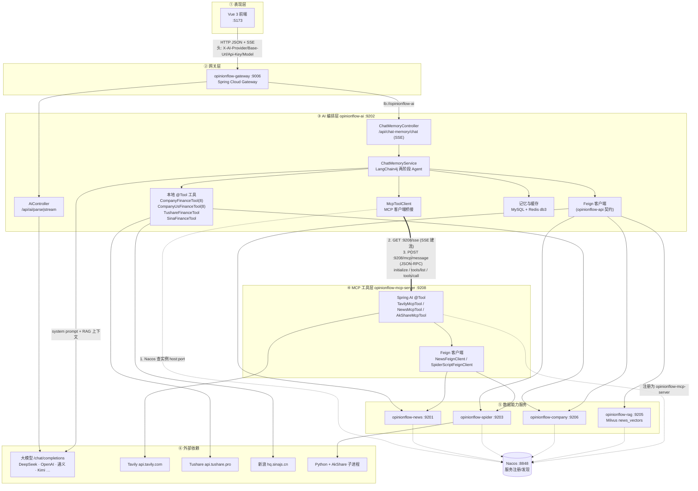
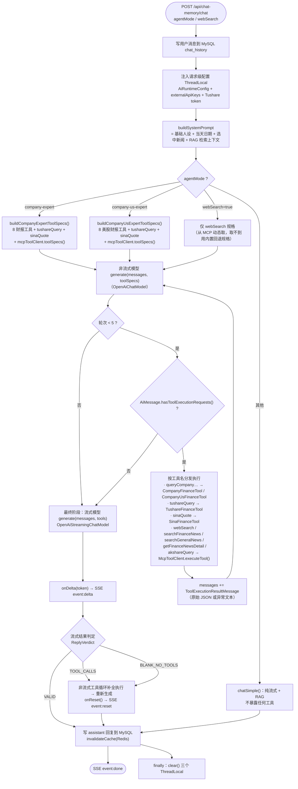

# OpinionFlow · AI / MCP Server 微服务技术栈与通信架构全图

> 本文档**完全依据仓库真实源码与配置文件绘制**（逐行核对 `build.gradle.kts`、`application.yml`、`ChatMemoryService.kt`、`McpToolClient.kt`、`McpServerConfig.kt`、网关路由等），
> 聚焦两条 AI 主线微服务：**`opinionflow-ai`（:9202，AI 编排）** 与 **`opinionflow-mcp-server`（:9208，MCP 工具服务）**，
> 以及它们与网关、Feign 下游服务、外部大模型/数据源之间的**全部通信链路**。
>
> 代码基线：`main` 分支；技术栈核验日期：2026-09-24。

---

## 0. 阅读指引与图例

| 符号 / 术语 | 含义 |
|-------------|------|
| `AI` | `opinionflow-ai` 微服务（:9202） |
| `MCP-S` | `opinionflow-mcp-server` 微服务（:9208） |
| `GW` | `opinionflow-gateway` 网关（:9006） |
| `lb://xxx` | Spring Cloud LoadBalancer 按服务名（Nacos 注册名）负载均衡寻址 |
| `SSE` | Server-Sent Events（`text/event-stream`），本项目有两种用途：**请求→前端**的流式回答；**MCP 客户端↔服务端**的协议传输 |
| `MCP` | Model Context Protocol（模型上下文协议），本项目使用 **SSE 传输**（`GET /sse` + `POST /mcp/message`） |
| `@Tool` | 工具方法注解。AI 服务侧用的是 **LangChain4j** 的 `dev.langchain4j.agent.tool.Tool`；MCP 服务侧用的是 **Spring AI** 的 `org.springframework.ai.tool.annotation.Tool` |
| 【本地工具】 | 仍在 `opinionflow-ai` 进程内、由 LangChain4j `ToolSpecification` + 手动 `ToolExecutionRequest` 循环调用的工具 |
| 【MCP 工具】 | 已迁移到 `opinionflow-mcp-server`，由 AI 侧通过 MCP 协议远程调用的工具 |

本文档共 6 组图 + 8 张表：

- 图 1 一页速览（端到端全景）
- 图 2 分层架构图（ASCII 逐层展开）
- 图 3 通信链路总览（Mermaid flowchart，含协议与地址）
- 图 4 链路 A：前端 ↔ AI 的 SSE 流式对话时序
- 图 5 链路 B：AI ↔ MCP Server 的 SSE + JSON-RPC 握手时序
- 图 6 Agent 工具决策循环（两阶段 + 多轮次）
- 表 1 技术栈版本总表 / 表 2 端口与路由表 / 表 3 MCP 工具清单 / 表 4 本地工具清单
- 表 5 配置项总表 / 表 6 请求级密钥与覆盖项 / 表 7 降级容错矩阵 / 表 8 关键类索引

---

## 1. 图 1 — 一页速览（端到端全景）

```
┌───────────────────────────────────────────────────────────────────────────────────────────────────────┐
│ ① 表现层   浏览器 / Vue 3（:5173）                                                                      │
│   AI 分析面板 · 对话记忆面板 · 🤖 中国企业专家 Agent · 🤖 美国企业专家 Agent · 「AI 设置」弹窗             │
└──────────────────────────────┬────────────────────────────────────────────────────────────────────────┘
                               │ HTTP(JSON) + SSE  ; 自定义请求头: X-AI-Provider / X-AI-Base-Url
                               │                                        X-AI-Api-Key / X-AI-Model
                               ▼
┌───────────────────────────────────────────────────────────────────────────────────────────────────────┐
│ ② 网关层   opinionflow-gateway (:9006) · Spring Cloud Gateway                                          │
│   /api/ai/**  /api/chat-memory/**  →  lb://opinionflow-ai      GlobalCORS: allowedOriginPatterns=*     │
└──────────────────────────────┬────────────────────────────────────────────────────────────────────────┘
                               │ lb://opinionflow-ai  (Nacos 服务发现)
                               ▼
┌───────────────────────────────────────────────────────────────────────────────────────────────────────┐
│ ③ AI 编排层   opinionflow-ai (:9202) · Spring Boot WebMvc + JPA + Redis + Feign                        │
│                                                                                                        │
│   Controller              Service（AI 引擎）                        Client / 桥接层                       │
│   ┌──────────────────┐   ┌───────────────────────────────────┐   ┌──────────────────────────────┐       │
│   │ AiController     │   │ AiParseService（原生 HttpClient）  │   │ Feign（opinionflow-api 契约）│       │
│   │   /api/ai/parse  │──▶│   · /chat/completions 非流式       │   │   RagFeignClient             │       │
│   │   parse/stream   │   │   · SSE delta 解析（流式）         │   │   CompanyFeignClient         │       │
│   ├──────────────────┤   ├───────────────────────────────────┤   │   CompanyUsFeignClient       │       │
│   │ ChatMemoryCtrl   │──▶│ ChatMemoryService（★核心编排）    │   │   NewsFeignClient            │       │
│   │  /chat  (SSE)    │   │   · LangChain4j 两阶段 Agent 循环  │   │   SpiderScriptFeignClient    │       │
│   │  /sessions       │   │   · MySQL chat_history 永久记忆    │   ├──────────────────────────────┤       │
│   │  /history /clear │   │   · Redis db3 热缓存(20min TTL)   │   │ McpToolClient（★MCP 客户端） │       │
│   ├──────────────────┤   │   · RAG 检索注入 system prompt    │   │   Nacos 发现 → SSE 传输       │       │
│   │ AiSettingsCtrl   │   │   · 请求级配置 ThreadLocal 注入   │   │   listTools → ToolSpecification│      │
│   │  /api/ai/models  │   │                                   │   │   callTool → 文本结果         │       │
│   └──────────────────┘   └───────────────────────────────────┘   └────────────┬─────────────────┘       │
│                                                                               │                        │
│   本地工具（LangChain4j @Tool，仍在 AI 进程内）                                │                        │
│   TushareFinanceTool · SinaFinanceTool · CompanyFinanceTool(8) ·               │                        │
│   CompanyUsFinanceTool(8) · (遗留)TavilySearchTool/NewsSearchTool/AkShareTool  │                        │
└─────────┬───────────────────────────────────┬─────────────────────────────────┼────────────────────────┘
          │ OpenAI 兼容 HTTPS                 │ Feign（Nacos+LB）               │ MCP over SSE（HTTP/1.1）
          ▼                                   ▼                                 ▼
┌───────────────────────┐   ┌───────────────────────────────────┐   ┌──────────────────────────────────┐
│ ④ 大模型层（外部）    │   │ ⑤ 数据/能力服务层（本项目微服务） │   │ ⑥ MCP 工具层                     │
│ DeepSeek / OpenAI /   │   │ opinionflow-rag     (:9205)       │   │ opinionflow-mcp-server  (:9208)  │
│ 硅基流动 / 通义 /      │   │ opinionflow-company (:9206)       │   │ Spring AI 1.0.0 MCP Server       │
│ Kimi / 智谱 /         │   │ opinionflow-news    (:9201)       │   │ (WebMvc SSE, type=SYNC)          │
│ OpenRouter / 自定义    │   │ opinionflow-spider  (:9203)       │   │                                  │
│ /chat/completions     │   │ （/api/ai/models 拉取模型清单）   │   │ TavilyMcpTool      → webSearch   │
└───────────────────────┘   └──────────────┬────────────────────┘   │ NewsMcpTool        → 3 个工具    │
                                           │                        │ AkShareMcpTool     → akshareQuery│
                                           │                        └───────────────┬──────────────────┘
                                           │        Feign（Nacos+LB）              │ Feign（Nacos+LB）
                                           │  ┌────────────────────────────────────┘
                                           ▼  ▼
┌───────────────────────────────────────────────────────────────────────────────────────────────────────┐
│ ⑦ 存储与外部数据源                                                                                      │
│   MySQL 8 (3306: spider / company_china / company_us)  ·  Redis 6 (6379: db3 会话缓存)                  │
│   Milvus 2.x (19530: news_vectors, dim=512, BgeSmallZhV15)  ·  Nacos 2.x (8848: 注册+配置)             │
│   Tavily API(api.tavily.com)  ·  Tushare(api.tushare.pro)  ·  新浪行情(hq.sinajs.cn)  ·  Python(AkShare)│
└───────────────────────────────────────────────────────────────────────────────────────────────────────┘
```

> **关键结论**：AI 服务的「工具面」被拆成两半 ——
> 财报 / Tushare / 新浪行情仍在 AI 进程内（本地 LangChain4j `@Tool`）；
> **联网搜索（Tavily）、项目新闻库检索、AkShare 已迁移到 `opinionflow-mcp-server`**，
> AI 侧通过 **MCP 协议（Nacos 服务发现 + SSE 传输）** 远程调用，工具清单运行时由 `listTools()` 动态拉取；
> MCP 不可用时静默降级为空工具集，AI 服务仍可正常启动并退化为纯文本对话。

---

## 2. 表 1 — 技术栈版本总表（按层）

| 层 | 技术 / 组件 | 版本 | 用途 | 代码出处 |
|----|-------------|------|------|----------|
| 语言/构建 | Kotlin | 2.1.20 | 全部服务主语言 | 根 `build.gradle.kts` |
| 语言/构建 | Java source/target | 17 | JVM 目标版本 | 各模块 `java { }` |
| 语言/构建 | Gradle（Kotlin DSL） | 9.4.1（腾讯云镜像） | 构建工具 | `gradle/wrapper/gradle-wrapper.properties` |
| 应用框架 | Spring Boot | 3.4.5 | Web / JPA / Validation | 根 `subprojects` 的 BOM |
| 应用框架 | Spring Cloud | 2024.0.1（根声明）/ 2023.0.3（ai、mcp-server 等模块内再声明） | 微服务治理 BOM | 根 + 各模块 `build.gradle.kts` |
| 应用框架 | Spring Cloud Alibaba | 2023.0.3.2 | Nacos 注册 / 配置 | 同上 |
| 服务治理 | Nacos Discovery | 2.x（`127.0.0.1:8848`） | 服务注册发现：AI→MCP-S 寻址、Feign 目标寻址 | 各 `application.yml` |
| 服务治理 | Spring Cloud LoadBalancer | 随 BOM | `lb://` 负载均衡 | `opinionflow-api`、gateway |
| 服务治理 | Spring Cloud Gateway | 随 BOM | 统一入口 / 全局 CORS | `opinionflow-gateway` |
| 服务间调用 | OpenFeign | 随 BOM | 声明式 HTTP（契约集中在 `opinionflow-api`） | 6 个 `@FeignClient` |
| AI 框架 | LangChain4j | **1.0.0-beta1** | 对话模型、工具调用、记忆窗口 | `opinionflow-ai/build.gradle.kts` |
| AI 框架 | `langchain4j-open-ai-spring-boot-starter` | 1.0.0-beta1 | OpenAI 兼容模型接入 | 同上 |
| AI 框架 | `langchain4j-milvus` | 1.0.0-beta1 | 向量库对接依赖 | 同上 |
| AI 框架 | `langchain4j-embeddings-bge-small-zh-v15` | 1.0.0-beta1（RAG 模块为 0.35.0） | 中文向量化模型 BGE-small-zh-v1.5（dim=512） | ai / rag 模块 |
| AI 框架 | Spring AI | **1.0.0**（spring-ai-bom） | MCP Server 端框架 | 根 BOM + `opinionflow-mcp-server` |
| AI 框架 | `spring-ai-starter-mcp-server` | 1.0.0 | MCP 服务端，自动收集 `ToolCallbackProvider` | `opinionflow-mcp-server` |
| MCP | `io.modelcontextprotocol.sdk:mcp` | **0.10.0** | MCP 官方 Java SDK（`McpClient.sync` / 服务端核心） | ai + mcp-server |
| MCP | `io.modelcontextprotocol.sdk:mcp-spring-webmvc` | **0.10.0** | WebMvc(Servlet) SSE 传输：服务端暴露 `GET /sse`+`POST /mcp/message`；客户端用作 SSE 传输 | ai（客户端）/ mcp-server（服务端） |
| 数据访问 | Spring Data JPA / Hibernate | 随 Boot | `chat_history` 等实体（`ddl-auto=update`） | ai / rag / company |
| 数据库 | MySQL | 8.x（`127.0.0.1:3306`） | `spider` / `company_china` / `company_us` | 各 `application.yml` |
| 缓存 | Redis（StringRedisTemplate） | 6.x，`database: 3` | 会话热缓存 `chat:history:<sid>`，TTL 20 分钟 | `opinionflow-ai` |
| 向量库 | Milvus | 2.x（`19530`，集合 `news_vectors`） | RAG 向量检索 | `opinionflow-rag` |
| 向量库 SDK | `io.milvus:milvus-sdk-java` | 2.4.1 | Milvus 客户端 | ai / rag |
| HTTP 客户端 | `java.net.http.HttpClient`（JDK 内置） | JDK 17 | Tavily / Tushare / 新浪行情 / 大模型调用 | 各 Tool、`AiParseService` |
| HTTP 客户端 | Spring `RestClient` | Boot 3.4 | `AiParseService` 中保留的通道 | `AiParseService.kt` |
| 序列化 | Jackson（`module-kotlin`、`datatype-jsr310`） | 随 Boot | JSON 编解码 | 全局 |
| 日志 | SLF4J + Logback | 随 Boot | 各服务 `logback-spring.xml` | ai / rag |
| 脚本引擎 | Python 子进程（`ProcessBuilder`） | 外部环境 | AkShare 财经脚本（`key=finance`） | `opinionflow-spider` |

---

## 3. 表 2 — 端口、服务名与网关路由

| 服务（Nacos 服务名） | 端口 | 启动类 | 职责 | 网关路由（`opinionflow-gateway/application.yml`） |
|----------------------|------|--------|------|--------------------------------------------------|
| `opinionflow-gateway` | **9006** | — | 统一入口、全局 CORS、路由转发 | —（自身） |
| `opinionflow-ai` | **9202** | `AiApplication` | AI 编排：AI 解析、对话记忆、Agent 工具循环、MCP 客户端 | `/api/ai/**`、`/api/chat-memory/**` → `lb://opinionflow-ai` |
| `opinionflow-mcp-server` | **9208** | `McpServerApplication` | MCP 工具服务：Tavily 搜索 / 新闻库检索 / AkShare（SSE 暴露） | **无网关路由（服务间专用，不经外部入口）** |
| `opinionflow-news` | 9201 | — | 新闻库（网易/纽约时报/雅虎财经/财经快讯） | `/api/news/**`、`/api/nytimes/**`、`/api/yahoo/**` |
| `opinionflow-spider` | 9203 | — | 爬虫脚本调度、评论、搜索结果 | `/api/scripts/**`、`/api/comments/**`、`/api/search-results/**` |
| `opinionflow-echart` | 9204 | — | ECharts JSON 持久化 | `/api/echart/**`、`/api/map-markers/**`、`/api/country-macro-indicators/**` |
| `opinionflow-rag` | 9205 | `RagApplication` | Milvus 向量导入与检索 | `/api/rag/**` → `lb://opinionflow-rag`（注意：控制器实际路径为 `/internal/rag/**`，见 §12 已知问题） |
| `opinionflow-company` | 9206 | `CompanyApplication` | 中国/美国企业财报（`company_china` / `company_us` 双数据源） | `/api/company/**`（已覆盖 `/api/company/us/**`） |

**AI 侧对外暴露的 HTTP 端点（经网关）**

| 方法 | 路径 | 控制器 | 协议 | 说明 |
|------|------|--------|------|------|
| POST | `/api/ai/parse` | `AiController` | JSON | 单轮非流式 AI 解析 |
| POST | `/api/ai/parse/stream` | `AiController` | **SSE**（`text/event-stream`） | 单轮流式解析，`SseEmitter` 独立单线程推流，事件名 `delta` |
| POST | `/api/ai/world-map-agent` | `AiController` | JSON | 世界格局地图 Agent（系统提示约束 JSON 输出） |
| GET | `/api/ai/settings`、`/api/ai/models` | `AiSettingsController` | JSON | AI 配置概况（含 token 脱敏、厂商预置清单）/ 调用 `GET {baseUrl}/models` 拉取模型清单（失败回落预置） |
| POST | `/api/chat-memory/chat` | `ChatMemoryController` | **SSE**（手工写 `event:delta` / `event:reset` / `event:done` / `event:error`） | ★ AI 主链路：带记忆的流式对话 |
| GET | `/api/chat-memory/sessions` | `ChatMemoryController` | JSON | 会话摘要列表 |
| POST | `/api/chat-memory/new-session` | `ChatMemoryController` | JSON | 生成 16 位 sessionId |
| GET | `/api/chat-memory/history` | `ChatMemoryController` | JSON | 会话历史（Redis→MySQL） |
| POST | `/api/chat-memory/clear` | `ChatMemoryController` | JSON | 清空会话（MySQL+Redis） |
| DELETE | `/api/chat-memory/session/{sessionId}` | `ChatMemoryController` | JSON | 删除会话 |

**MCP Server 对外暴露的端点（仅服务间可见）**

| 方法 | 路径 | 由谁提供 | 协议 | 说明 |
|------|------|----------|------|------|
| GET | `:9208/sse` | `McpWebMvcServerAutoConfiguration`（`mcp-spring-webmvc`）+ `spring.ai.mcp.server.sse-endpoint=/sse` | SSE | 建立会话，服务端推送 `event: endpoint` 告知消息端点 |
| POST | `:9208/mcp/message` | 同上（默认消息端点） | JSON-RPC over HTTP | 接收 `initialize` / `tools/list` / `tools/call` 等请求 |

---

## 4. 图 2 — 分层架构图（逐层展开到类级）

> 说明：本图按「层」由上到下展开到**类/Bean 粒度**；`（本地）` = AI 进程内工具，`（MCP）` = 远程 MCP 工具。

```
════════════════════════════════════════════════════════════════════════════════════════════════
 层 1 · 表现层  ── Vue 3（opinionflow-vue，dev 端口 5173）
════════════════════════════════════════════════════════════════════════════════════════════════
   ├─ AI 分析面板 / 对话记忆面板 ────────▶ POST /api/chat-memory/chat   （fetch + ReadableStream 解析 SSE）
   ├─ 「AI 设置」弹窗 ─────────────────▶ GET  /api/ai/settings、/api/ai/models
   │     用户填写 provider / baseUrl / api-key / model
   │     └─ 之后每次请求都带 4 个自定义头（见 表 6）→ 后端按请求覆盖默认配置
   ├─ 🤖 中国企业专家 Agent 面板 ──────▶ POST /api/chat-memory/chat
   │     body: { sessionId: "company_china_600519", content, agentMode: "company-expert",
   │             externalApiKeys: { tushareToken } }
   └─ 🤖 美国企业专家 Agent 面板 ──────▶ 同上，agentMode = "company-us-expert"，会话前缀 company_us_<ticker>

════════════════════════════════════════════════════════════════════════════════════════════════
 层 2 · 接入/网关层 ── opinionflow-gateway :9006（Spring Cloud Gateway）
════════════════════════════════════════════════════════════════════════════════════════════════
   ├─ GlobalCORS：allowedOriginPatterns=* / allowedMethods=* / allowedHeaders=* / allowCredentials=true
   ├─ 路由（Predicate → lb:// 目标服务）
   │    /api/ai/**,  /api/chat-memory/**                          → lb://opinionflow-ai        ★ AI 主链路
   │    /api/company/**                                          → lb://opinionflow-company
   │    /api/news/**, /api/nytimes/**, /api/yahoo/**              → lb://opinionflow-news
   │    /api/scripts/**, /api/comments/**, /api/search-results/** → lb://opinionflow-spider
   │    /api/echart/**, /api/map-markers/**, /api/country-macro-indicators/** → lb://opinionflow-echart
   │    /api/rag/**                                              → lb://opinionflow-rag
   └─ 注意：opinionflow-mcp-server（:9208）**不经过网关**，仅供服务间调用

════════════════════════════════════════════════════════════════════════════════════════════════
 层 3 · AI 编排层 ── opinionflow-ai :9202（Spring Boot WebMvc + Data JPA + Redis + OpenFeign）
════════════════════════════════════════════════════════════════════════════════════════════════
  启动装配：@SpringBootApplication(scan=common+ai) + @EnableDiscoveryClient
            + @EnableFeignClients(com.lespider.opinionflow.api) + @EnableJpaRepositories(ai.repo)

  ├─ 3.1 控制器层
  │    ├─ AiController          /api/ai/parse · /api/ai/parse/stream(SSE SseEmitter) · /api/ai/world-map-agent
  │    ├─ AiSettingsController  /api/ai/settings · /api/ai/models
  │    └─ ChatMemoryController  /api/chat-memory/{chat(SSE), sessions, new-session, history, clear, session/{id}}
  │
  ├─ 3.2 AI 服务层
  │    ├─ AiParseService        原生 HttpClient → OpenAI 兼容 /chat/completions（非流式 + 流式 SSE 逐行解析 delta）
  │    │                        baseUrl 归一化：AiUrlNormalizer（剥离 /chat/completions 等尾缀；无路径则补 /v1）
  │    ├─ AiModelCatalogService  拉取 {baseUrl}/models；失败回落 AiProviderPresets.fallbackModels
  │    ├─ AiProviderPresets      8 个预置厂商：deepseek/openai/siliconflow/dashscope/moonshot/zhipu/openrouter/custom
  │    └─ ChatMemoryService      ★核心编排
  │         ├─ 记忆：ChatHistoryRepository(MySQL chat_history) + StringRedisTemplate(db3, TTL 20min, key chat:history:<sid>)
  │         │        MessageWindowChatMemory（MAX_MESSAGES=40，仅用于构建发给模型的消息窗口）
  │         ├─ 模型：buildStreamingModel()    → OpenAiStreamingChatModel（最终回复·流式）
  │         │        buildNonStreamingModel() → OpenAiChatModel（工具决策 / 兜底重生成）
  │         ├─ 模式分发 chatWithMemory(agentMode) ──┬─ "company-expert"    → chatWithCompanyExpert   → chatWithExpertTools
  │         │                                       ├─ "company-us-expert" → chatWithCompanyUsExpert → chatWithExpertTools
  │         │                                       ├─ webSearch=true && tavilyEnabled → chatWithAgent（单工具 webSearch）
  │         │                                       └─ 其他 → chatSimple（含 RAG 的纯文本流式）
  │         ├─ Prompt：buildSystemPrompt(选中新闻 + RAG 检索 + 当天日期) + 企业专家专用 System Prompt
  │         ├─ RAG：retrieveRelevantNews() → RagFeignClient.search(topK=5, maxDistance=50.0) → 注入 system prompt
  │         └─ 流式异常治理：ReplyVerdict{VALID | TOOL_CALLS | BLANK_NO_TOOLS} + streamingFallbackResend + onReset(event:reset)
  │
  ├─ 3.3 工具层（本地，LangChain4j @Tool）── 详见 表 4
  │    ├─ CompanyFinanceTool（8 工具）───▶ CompanyFeignClient    ──▶ opinionflow-company /api/company
  │    ├─ CompanyUsFinanceTool（8 工具）─▶ CompanyUsFeignClient  ──▶ opinionflow-company /api/company/us
  │    ├─ TushareFinanceTool.tushareQuery ──▶ api.tushare.pro（token：ThreadLocal > key.properties）
  │    ├─ SinaFinanceTool.sinaQuote ──▶ hq.sinajs.cn（GBK 解码，需 Referer）
  │    └─ 遗留（已迁移至 MCP，仅注入未调用）：TavilySearchTool / NewsSearchTool / AkShareTool
  │
  ├─ 3.4 桥接层
  │    └─ McpToolClient          ★ MCP 客户端桥接器
  │         ├─ connect()           懒连接 + synchronized 双检锁；@PreDestroy 关闭客户端
  │         ├─ resolveServerUri()  DiscoveryClient.getInstances("opinionflow-mcp-server") → http(s)://host:port
  │         ├─ buildSyncClient()   HttpClientSseClientTransport.Builder(uri).sseEndpoint("/sse")
  │         │                      → McpClient.sync(transport).requestTimeout(30s).initializationTimeout(30s)
  │         │                        .capabilities(ClientCapabilities) → client.initialize()
  │         ├─ toolSpecs()         client.listTools() → McpSchema.Tool → LangChain4j ToolSpecification
  │         │                      （JsonSchema.properties → addString/Integer/Number/BooleanProperty + required）
  │         └─ executeTool(name, argsJson) → client.callTool(CallToolRequest) → TextContent 拼接为纯文本
  │
  └─ 3.5 请求级上下文（ThreadLocal，防跨请求串用）
       ├─ AiRuntimeConfigManager   前端 AI 设置的 baseUrl / apiKey / model 覆盖
       ├─ CompanyAgentKeyManager   前端 externalApiKeys（如 tushareToken）
       └─ TushareFinanceTool.runtimeToken
       生命周期：chatWithMemory 进入时 inject() → finally 中 clear()（同一线程内完成工具决策→执行→推流）


════════════════════════════════════════════════════════════════════════════════════════════════
 层 4 · MCP 工具层 ── opinionflow-mcp-server :9208（Spring AI 1.0.0 MCP Server + WebMvc SSE）
════════════════════════════════════════════════════════════════════════════════════════════════
  启动装配：@SpringBootApplication(scan=common+mcp) + @EnableDiscoveryClient
            + @EnableFeignClients(com.lespider.opinionflow.api)
            spring.ai.mcp.server: name=opinionflow-mcp-server · version=1.0.0 · type=SYNC
                                 sse-endpoint=/sse · enabled=true
            （不带 base-url：SSE 的 endpoint 事件返回相对路径，由客户端按 Nacos 解析出的 baseUri 还原）

  ├─ 4.1 工具注册（McpServerConfig）
  │    MethodToolCallbackProvider.builder()
  │        .toolObjects(TavilyMcpTool, NewsMcpTool, AkShareMcpTool)
  │        .build()  ──▶ ToolCallbackProvider
  │    └─ 交由 Spring AI McpServerAutoConfiguration 自动注册为 MCP 工具（SSE 暴露给 MCP Client）
  │
  ├─ 4.2 工具实现（Spring AI @Tool 注解）
  │    ├─ TavilyMcpTool.webSearch(query)
  │    │    配置 opinionflow.tavily.{enabled, api-key, base-url, max-results=12, search-depth=advanced}
  │    │    JDK HttpClient POST {baseUrl}/search（30s 超时）→ 解析 answer + results[] → 文本化输出
  │    ├─ NewsMcpTool（3 工具，复用 opinionflow-api 的 NewsFeignClient）
  │    │    searchFinanceNews / searchGeneralNews / getFinanceNewsDetail
  │    │    ──▶ opinionflow-news /api/news/finance · /api/news · /api/news/finance/{id}
  │    └─ AkShareMcpTool.akshareQuery(symbol, mode, start, end)
  │         组装 params(symbol&mode&start&end) → SpiderScriptFeignClient.run(key="finance", symbol, code=params)
  │         ──▶ opinionflow-spider POST /api/scripts/run → ProcessBuilder 启动 Python（AkShare）
  │
  └─ 4.3 容错设计：每个工具方法整体 try/catch，异常或未配置时返回**人类可读文本**而非抛错，
          保证 MCP 调用失败不会中断 AI 侧的 Agent 循环

════════════════════════════════════════════════════════════════════════════════════════════════
 层 5 · 数据/能力服务层（本项目其它微服务，被 Feign 调用）
════════════════════════════════════════════════════════════════════════════════════════════════
   ├─ opinionflow-rag :9205       /internal/rag/search（Milvus 向量检索）+ /internal/rag/health
   ├─ opinionflow-company :9206   /api/company/**（中国库 company_china）+ /api/company/us/**（美股库 company_us）
   ├─ opinionflow-news :9201      /api/news/**（通用新闻 + 财经快讯）
   └─ opinionflow-spider :9203    /api/scripts/run（Python 脚本调度，key=comments|news|realtime|finance）

════════════════════════════════════════════════════════════════════════════════════════════════
 层 6 · 外部依赖层（第三方 API / 运行时）
════════════════════════════════════════════════════════════════════════════════════════════════
   ├─ 大模型（OpenAI 兼容 /chat/completions）：DeepSeek · OpenAI · 硅基流动 · 阿里云百炼 · Kimi · 智谱 · OpenRouter · 自建网关
   ├─ Tavily 搜索：https://api.tavily.com（POST /search，search_depth=advanced）
   ├─ Tushare：https://api.tushare.pro（POST，token 鉴权）
   ├─ 新浪财经行情：https://hq.sinajs.cn/list=<symbol>（需 Referer，GBK 响应）
   └─ Python 运行时（AkShare 库）：由 opinionflow-spider 以子进程方式执行

════════════════════════════════════════════════════════════════════════════════════════════════
 层 7 · 存储与基础设施层
════════════════════════════════════════════════════════════════════════════════════════════════
   ├─ MySQL 8 :3306   spider（chat_history / 新闻 / 评论 …）· company_china · company_us
   ├─ Redis 6 :6379   db3 会话热缓存：key chat:history:<sessionId>，TTL 20 分钟
   ├─ Milvus 2 :19530 集合 news_vectors（VECTOR_DIM=512 · BgeSmallZhV15 · BATCH_SIZE=500）
   │                   增量导入状态表 milvus_import_state（避免重复导入）
   └─ Nacos 2 :8848   服务注册（全部微服务）+ 配置中心（file-extension=yml，import-check=false）
```

---

## 5. 图 3 — 通信链路总览（协议 + 地址 + 数据形态）



**说明（图 3 要点）**

1. 前端→AI 只有 **1 个主入口**（`/api/chat-memory/chat`），响应是**手工写的 SSE**（`event:delta/reset/done/error`），不经过 Spring 的 `SseEmitter`。
2. AI→大模型有 **两条独立通道**：`AiParseService` 的原生 `HttpClient`（解析类接口），以及 LangChain4j 的 `OpenAiChatModel`/`OpenAiStreamingChatModel`（对话记忆 / Agent 链路）。
3. AI→MCP-S 是**唯一一条非 HTTP-REST 的服务间链路**：Nacos 发现地址后走 **MCP over SSE + JSON-RPC**。
4. MCP-S 自身也持有一组 Feign 客户端（复用 `opinionflow-api` 契约），因此 **AI 进程与 MCP 进程都可能访问 news/spider**，只是 AI 侧的新闻/AkShare 工具已废弃不再调用。

---

## 6. 图 4 — 链路 A：前端 ↔ AI 的 SSE 流式对话（含工具决策）

```mermaid
sequenceDiagram
    autonumber
    participant FE as 前端 Vue
    participant GW as Gateway :9006
    participant C as ChatMemoryController
    participant S as ChatMemoryService
    participant DB as MySQL chat_history
    participant R as Redis db3
    participant RAGS as opinionflow-rag
    participant LLM as 大模型(OpenAI 兼容)
    participant MCP as McpToolClient
    participant MCPS as mcp-server :9208

    FE->>GW: POST /api/chat-memory/chat<br/>{sessionId,content,agentMode,externalApiKeys} + 4 个 X-AI-* 头
    GW->>C: 转发(lb://opinionflow-ai)
    C->>C: 设置 text/event-stream / UTF-8 / no-cache / keep-alive
    C->>S: chatWithMemory(sessionId, content, ...)
    S->>DB: save(role=user, content)
    S->>S: inject 请求级配置(ThreadLocal)<br/>AiRuntimeConfigManager + CompanyAgentKeyManager + Tushare token
    S->>S: buildSystemPrompt()：当天日期 + 选中新闻
    S->>RAGS: (Feign) POST /internal/rag/search {query,topK=5,maxDistance=50}
    RAGS-->>S: List&lt;RagSearchResult&gt; → 拼成新闻上下文注入 system prompt
    S->>S: buildStreamingModel() / buildNonStreamingModel()<br/>baseUrl = 请求头 > key.properties，经 AiUrlNormalizer 归一

    alt Agent 模式（company-expert / company-us-expert / webSearch=true）
        S->>MCP: toolSpecs()（本地工具规格 + MCP 动态工具规格）
        MCP->>MCPS: initialize + tools/list (JSON-RPC over SSE)
        MCPS-->>MCP: tools[]（webSearch / searchFinanceNews / …）
        MCP-->>S: List&lt;ToolSpecification&gt;
        loop 工具决策最多 5 轮（非流式）
            S->>LLM: POST /chat/completions (messages + tools)
            LLM-->>S: AiMessage（可能带 toolExecutionRequests）
            alt 需要工具
                S->>S: executeCompanyExpertTool() / executeAgentWebSearch() 分发
                S->>MCPS: (MCP) tools/call {name, arguments}
                MCPS-->>S: TextContent 文本结果
                S->>S: 追加 ToolExecutionResultMessage 进 messages
            else 无需工具
                S->>S: 跳出循环，进入最终流式
            end
        end
        S->>LLM: 最终回复（stream=true, stream_options=include_usage）
        loop 每个 delta
            LLM-->>S: choices[0].delta.content
            S-->>C: onDelta(token)
            C-->>FE: event:delta\ndata:&lt;转义后的 token&gt;\n\n
        end
    else 传统模式 chatSimple（含 RAG）
        S->>LLM: 流式请求（工具被禁用）
        loop delta → FE
            LLM-->>S: delta
            S-->>C: onDelta → event:delta
            C-->>FE: event:delta
        end
    end

    opt 流式阶段异常（空内容 / 工具通道问题）
        S->>S: replyVerdict() 判定 → 非流式工具循环补全并重生成
        S-->>C: onReset()
        C-->>FE: event:reset\ndata:{}
    end

    S->>DB: save(role=assistant, 完整回复)
    S->>R: delete chat:history:&lt;sessionId&gt;（下次读回源 MySQL 重建缓存）
    C-->>FE: event:done\ndata:{"ok":true}
    C->>S: finally：clear() 三个 ThreadLocal（防密钥残留）
```

**事件契约（前端需按此解析）**

| 事件名 | data | 触发点 | 前端动作 |
|--------|------|--------|----------|
| `delta` | 单个增量 token（`\`、`\n`、`\r` 已转义） | 模型流式输出每一片 | 追加到当前气泡 |
| `reset` | `{}` | 流式内容无效、后端已重生成 | **清空当前气泡**后继续接收 delta |
| `done` | `{"ok":true}` | 正常结束（已写入 MySQL） | 结束 loading、刷新会话列表 |
| `error` | 错误文本（已转义） | 校验失败 / 模型异常 | 展示错误提示 |


---

## 7. 图 5 — 链路 B：AI ↔ MCP Server（Nacos 发现 + SSE + JSON-RPC 握手）

### 7.1 时序图

```mermaid
sequenceDiagram
    autonumber
    participant S as ChatMemoryService
    participant MCPC as McpToolClient<br/>(AI 侧)
    participant NACOS as Nacos :8848
    participant MCPS as mcp-server :9208<br/>(WebMvc SSE Transport)
    participant TOOL as TavilyMcpTool /<br/>NewsMcpTool / AkShareMcpTool
    participant DOWN as 下游服务/外部 API

    Note over MCPC: 懒连接：首次 toolSpecs()/executeTool() 时触发
    S->>MCPC: toolSpecs() 或 executeTool(name,argsJson)
    MCPC->>MCPC: connect()：synchronized 双检锁，避免并发重复建连
    MCPC->>NACOS: DiscoveryClient.getInstances("opinionflow-mcp-server")
    NACOS-->>MCPC: instances[]（host/port）
    MCPC->>MCPC: scheme = https（port=8443 或 metadata.secure=true）否则 http<br/>uri = "http://host:9208"

    MCPC->>MCPS: GET /sse  （Accept: text/event-stream，长连接建立）
    MCPS-->>MCPC: event: endpoint<br/>data: /mcp/message?sessionId=&lt;uuid&gt;
    MCPC->>MCPC: HttpClientSseClientTransport 记录消息端点（不硬编码）

    MCPC->>MCPS: POST /mcp/message?sessionId=… （JSON-RPC: initialize）
    MCPS-->>MCPC: { result: { protocolVersion, capabilities, serverInfo:{name:opinionflow-mcp-server,version:1.0.0} } }
    Note over MCPC: notification: notifications/initialized<br/>requestTimeout=30s / initializationTimeout=30s

    MCPC->>MCPS: POST /mcp/message （JSON-RPC: tools/list）
    MCPS->>TOOL: MethodToolCallbackProvider 收集 @Tool 元数据
    MCPS-->>MCPC: tools[] = webSearch / searchFinanceNews / searchGeneralNews / getFinanceNewsDetail / akshareQuery<br/>(每个含 name、description、inputSchema)
    MCPC->>MCPC: Tool 转 ToolSpecification（name/description/JsonObjectSchema 属性与 required）
    MCPC-->>S: List&lt;ToolSpecification&gt;（与本地工具规格合并）

    Note over S: 非流式模型决策后，AI 决定调用某个 MCP 工具
    S->>MCPC: executeTool("webSearch", "{\"query\":\"…\"}")
    MCPC->>MCPC: parseArguments()：JSON → Map（失败则空 Map，不抛错）
    MCPC->>MCPS: POST /mcp/message （JSON-RPC: tools/call {name, arguments}）
    MCPS->>TOOL: 反射调用带 @Tool 的方法（SSE 传输，type=SYNC）
    TOOL->>DOWN: Feign（news/spider）或 HttpClient（Tavily）
    DOWN-->>TOOL: 原始数据
    TOOL-->>MCPS: 文本化结果（工具内部 try/catch，异常也返回文本）
    MCPS-->>MCPC: { result: { content:[{type:"text", text:"…"}], isError:false } }
    MCPC->>MCPC: extractText()：TextContent 逐条拼接 + trim
    MCPC-->>S: 纯文本 → 作为 ToolExecutionResultMessage 回灌模型
```

### 7.2 工具桥接映射（左右两侧的类型转换）

```
       AI 侧（LangChain4j 模型）                                MCP 侧（Spring AI + MCP SDK）
┌────────────────────────────────────┐                ┌────────────────────────────────────────┐
│ 本地/远程统一为 ToolSpecification   │                │  @Tool 注解方法（Spring AI）           │
│  · name() : String                  │   tools/list   │   TavilyMcpTool.webSearch(String)      │
│  · description() : String           │ ◀────────────  │   NewsMcpTool.searchFinanceNews(...)   │
│  · parameters() : JsonObjectSchema  │                │   AkShareMcpTool.akshareQuery(...)     │
│      addStringProperty(...) 等      │                │   ↓ MethodToolCallbackProvider         │
└────────────────────────────────────┘                │  inputSchema（JSON Schema）            │
             ▲                                          └────────────────────────────────────────┘
             │ toToolSpecification(McpSchema.Tool)
             │                              tools/call
             ▼                              ─────────▶  McpSchema.CallToolRequest(name, arguments: Map)
┌────────────────────────────────────┐                ┌────────────────────────────────────────┐
│ ToolExecutionRequest(name,argsJson) │                │ McpSchema.CallToolResult               │
│        ↓ parseArguments()           │                │   content : List<Content>              │
│  Map<String, Any>（JSON 反序列化）  │ ◀────────────  │   isError : Boolean                    │
│        ↓ extractText()              │   text 拼接    └────────────────────────────────────────┘
│ String（回灌为 ToolExecutionResultMessage）              │
└────────────────────────────────────┘
```

**关键实现细节（源码级）**

| 环节 | 代码 | 行为 |
|------|------|------|
| 地址解析 | `McpToolClient.resolveServerUri()` | `discoveryClient.getInstances("opinionflow-mcp-server")` 取**第一个实例**；`port==8443` 或 `metadata["secure"]=="true"` 用 `https`，否则 `http` |
| 传输构建 | `HttpClientSseClientTransport.Builder(uri).sseEndpoint("/sse")` | 传输实现来自 `mcp-spring-webmvc:0.10.0`；SSE 端点由 `opinionflow.mcp.sse-path` 配置（默认 `/sse`） |
| 客户端构建 | `McpClient.sync(transport).requestTimeout(30s).initializationTimeout(30s).capabilities(ClientCapabilities(null,null,null))` | **同步**客户端（`McpSyncClient`），与 `spring.ai.mcp.server.type=SYNC` 对应；超时由 `opinionflow.mcp.timeout-seconds` 控制 |
| 连接复用 | `@Volatile syncClient` + `synchronized` 双检锁 | 单实例长连接；`@PreDestroy shutdown()` 关闭 |
| 工具名缓存 | `ConcurrentHashMap<String,Boolean> toolNames` | `listTools()` 时登记；`executeTool()` 对未知工具仅告警仍尝试透传（不阻断） |
| 参数转换 | `parseArguments()` / `toJsonObjectSchema()` | JSON→Map；属性类型仅区分 `integer/number/boolean`，其余统一按 `string`（简化但可被模型正确理解） |
| 结果转换 | `extractText()` | 只取 `TextContent.text()`，多条按行拼接；错误且无文本时给占位文案 |
| 服务端注册 | `McpServerConfig.mcpToolCallbackProvider()` | `MethodToolCallbackProvider.builder().toolObjects(三个工具).build()` → 自动注册 |
| 服务端传输 | `spring-ai-starter-mcp-server` + `mcp-spring-webmvc` | base starter 只带核心 SDK（会回落 STDIO，不暴露 HTTP）；必须额外引入 `mcp-spring-webmvc` 才会启用 `McpWebMvcServerAutoConfiguration` |
| 服务端不设 base-url | `application.yml` 注释 | SSE `endpoint` 事件返回**相对路径**，由客户端按 Nacos 解析出的 `host:port` 还原，避免把 `127.0.0.1` 写死 |

---

## 8. 图 6 — AI 侧 Agent 工具决策循环（两阶段 + 多轮）



**轮次与超时约束**

| 约束 | 取值 | 出处 |
|------|------|------|
| 工具决策最大轮数 | `maxToolRounds() = 5` | `ChatMemoryService` |
| 对话窗口最大消息数 | `MAX_MESSAGES = 40` | `MessageWindowChatMemory` |
| Redis 会话缓存 TTL | 20 分钟（`chat:history:<sid>`） | `ChatMemoryService.REDIS_TTL` |
| MCP 请求/初始化超时 | 30s（`opinionflow.mcp.timeout-seconds`） | `opinionflow-ai/application.yml` |
| Feign 连接/读取超时 | 5s / 120s（默认）；`opinionflow-company` 客户端日志级别 `none` | `opinionflow-ai/application.yml` |
| SSE 前端超时 | 不超时（`SseEmitter(0L)`；`/chat-memory/chat` 为手工长连接） | `AiController` / `ChatMemoryController` |

---

## 9. 表 3 — MCP 工具清单（`opinionflow-mcp-server` :9208）

| MCP 工具名 | 服务端方法 | 入参（JSON Schema） | 数据来源 | 失败表现（工具内 catch） |
|------------|-----------|---------------------|----------|--------------------------|
| `webSearch` | `TavilyMcpTool.webSearch` | `query: string`（必填） | Tavily `POST {base-url}/search`（`max_results=12`、`search_depth=advanced`、`include_answer=true`） | 未启用/无 key → “Tavily 联网搜索未启用或 API Key 未配置。”；HTTP 非 200 → “Tavily 搜索失败：HTTP xxx” |
| `searchFinanceNews` | `NewsMcpTool.searchFinanceNews` | `keyword: string`、`start?: string`、`end?: string` | `NewsFeignClient.finance(0,20,start,end,keyword)` → `opinionflow-news /api/news/finance` | “财经快讯检索失败：{message}” |
| `searchGeneralNews` | `NewsMcpTool.searchGeneralNews` | `keyword: string`、`start?`、`end?` | `NewsFeignClient.general(0,20,start,end,keyword)` → `opinionflow-news /api/news` | “通用新闻检索失败：{message}” |
| `getFinanceNewsDetail` | `NewsMcpTool.getFinanceNewsDetail` | `id: integer` | `NewsFeignClient.financeDetail(id)` → `opinionflow-news /api/news/finance/{id}` | “财经快讯详情获取失败：{message}” |
| `akshareQuery` | `AkShareMcpTool.akshareQuery` | `symbol: string`、`mode: string`（info/spot/hist/news/industry）、`start?`、`end?` | `SpiderScriptFeignClient.run(key="finance", symbol, code="symbol=..&mode=..&start=..&end=..")` → `opinionflow-spider /api/scripts/run` → Python AkShare | “AkShare 脚本执行失败：{message} | {stderr}” / “AkShare 查询异常：{message}” |

**MCP 服务端配置（`opinionflow-mcp-server/application.yml` 摘要）**

```yaml
server:
  port: 9208                                    # MCP 服务端口
spring:
  application:
    name: opinionflow-mcp-server                # Nacos 注册名（AI 侧 opinionflow.mcp.server-name 必须一致）
  config:
    import: optional:file:./key.properties,optional:file:../key.properties   # 读取 tavily.api-key 等
  cloud:
    nacos:
      discovery: { server-addr: 127.0.0.1:8848 }
      config:    { server-addr: 127.0.0.1:8848, file-extension: yml, import-check.enabled: false }
spring.ai.mcp.server:
  name: opinionflow-mcp-server
  version: 1.0.0
  type: SYNC                                    # 同步 McpServer
  sse-endpoint: /sse                            # 与 AI 侧 opinionflow.mcp.sse-path 保持一致
  enabled: true
opinionflow.tavily:
  enabled: true
  api-key: ${tavily.api-key:}
  base-url: ${tavily.base-url:https://api.tavily.com}
  max-results: 12
  search-depth: advanced
spring.cloud.openfeign.client.config.default:
  connect-timeout: 5000
  read-timeout: 120000
  logger-level: full
```

---

## 10. 表 4 — AI 侧「本地工具」清单（LangChain4j `@Tool`，仍在 `opinionflow-ai` 进程内）

| 工具名（ToolSpecification） | 实现类与方法 | 数据来源 / 通路 | 何时暴露 |
|-----------------------------|--------------|-----------------|----------|
| `queryCompany` | `CompanyFinanceTool.queryCompany` | `CompanyFeignClient.list(keyword,null,0,5,null,null)` → `opinionflow-company /api/company/list` | company-expert |
| `queryCompanyDetail` | `CompanyFinanceTool.queryCompanyDetail` | `/api/company/{id}/detail` | company-expert |
| `queryIncomeStatement` | `CompanyFinanceTool.queryIncomeStatement` | `/api/company/reports/{reportId}/income` | company-expert |
| `queryBalanceSheet` | `CompanyFinanceTool.queryBalanceSheet` | `/api/company/reports/{reportId}/balance` | company-expert |
| `queryCashFlow` | `CompanyFinanceTool.queryCashFlow` | `/api/company/reports/{reportId}/cashflow` | company-expert |
| `queryFinancialIndicators` | `CompanyFinanceTool.queryFinancialIndicators` | `/api/company/reports/{reportId}/indicators` | company-expert |
| `queryIndicatorHistory` | `CompanyFinanceTool.queryIndicatorHistory` | `/api/company/{companyId}/indicators/{code}/history` | company-expert |
| `queryPeerCompare` | `CompanyFinanceTool.queryPeerCompare` | `/api/company/indicators/{code}/peer-compare` | company-expert |
| `queryCompany` … `queryPeerCompare`（同名 8 个） | `CompanyUsFinanceTool.*` | `CompanyUsFeignClient` → `/api/company/us/**`（`contextId=companyUsFeignClient`） | company-us-expert |
| `tushareQuery` | `TushareFinanceTool.tushareQuery(apiName, params)` | `HttpClient POST https://api.tushare.pro`；token 取值顺序：请求体 `externalApiKeys.tushareToken` → `opinionflow.finance.tushare-token` | 两个专家 Agent |
| `sinaQuote` | `SinaFinanceTool.sinaQuote(symbol)` | `HttpClient GET https://hq.sinajs.cn/list=<symbol>`（带 Referer，GBK 解码） | 两个专家 Agent |
| ~~`webSearch`~~ | ~~`TavilySearchTool.webSearch`~~ | 已迁至 MCP（`TavilyMcpTool`）；该类仍被注入但**不再参与工具表** | 不再暴露 |
| ~~`searchFinanceNews` / `searchGeneralNews` / `getFinanceNewsDetail`~~ | ~~`NewsSearchTool.*`~~ | 已迁至 MCP（`NewsMcpTool`） | 不再暴露 |
| ~~`akshareQuery`~~ | ~~`AkShareTool.akshareQuery`~~ | 已迁至 MCP（`AkShareMcpTool`） | 不再暴露 |

> **工具名 ↔ 执行入口映射**（`ChatMemoryService.executeCompanyExpertTool` / `executeCompanyUsExpertTool`）：
> - 本地：`queryCompany*` → `companyFinanceTool` / `companyUsFinanceTool`；`tushareQuery` → `tushareFinanceTool`；`sinaQuote` → `sinaFinanceTool`
> - MCP：`webSearch` / `searchFinanceNews` / `searchGeneralNews` / `getFinanceNewsDetail` / `akshareQuery` → **全部走 `mcpToolClient.executeTool(name, rawArgs)`**
> - 未知工具 → 记录 warn 并返回字符串 `未知工具`（不抛异常，Agent 循环可继续）

---

## 11. 表 5 — AI 服务配置项总表

**`opinionflow-ai/src/main/resources/application.yml` + `key.properties`（`spring.config.import` 可选导入）**

| 配置项 | 默认 / 示例 | 作用 |
|--------|-------------|------|
| `server.port` | `9202` | 服务端口 |
| `spring.application.name` | `opinionflow-ai` | Nacos 注册名（网关路由 `lb://opinionflow-ai` 依赖它） |
| `spring.config.import` | `optional:file:./key.properties,optional:file:../key.properties` | 敏感配置注入（AI key、Tavily key、Tushare token、Python 脚本路径） |
| `spring.datasource.url` | `jdbc:mysql://127.0.0.1:3306/spider…` | 对话记忆库 |
| `spring.data.redis` | `127.0.0.1:6379 / database: 3` | 会话热缓存（独立 db3，避免污染其它服务） |
| `spring.jpa.hibernate.ddl-auto` | `update` | 自动维护 `chat_history` 表结构 |
| `spring.cloud.nacos.discovery/config.server-addr` | `127.0.0.1:8848` | 注册与配置中心 |
| `spring.cloud.compatibility-verifier.enabled` | `false` | 关闭 Spring Cloud 版本兼容校验（混用版本时必需） |
| `opinionflow.ai.api-url` | `${opinionflow.ai.api-url}`（`key.properties`） | 默认大模型 baseUrl（可被请求头 `X-AI-Base-Url` 覆盖） |
| `opinionflow.ai.api-key` | `${opinionflow.ai.api-key}` | 默认 token（可被 `X-AI-Api-Key` 覆盖） |
| `opinionflow.ai.model` | `${opinionflow.ai.model}` | 默认模型名（可被 `X-AI-Model` 覆盖） |
| `opinionflow.rag.enabled` | `true` | RAG 注入开关（选中新闻存在时强制检索） |
| `opinionflow.rag.top-k` | `5` | 向量检索条数 |
| `opinionflow.rag.max-distance` | `50.0` | 相似度距离阈值 |
| `opinionflow.rag.context-prefix` | `以下是与用户问题相关的新闻资料，供你参考分析：` | 注入提示前缀 |
| `opinionflow.tavily.enabled` | `true` | 决定 `webSearch=true` 时是否进入通用 Agent 模式 |
| `opinionflow.tavily.api-key` / `base-url` / `max-results` / `search-depth` | `${tavily.api-key}` / `https://api.tavily.com` / `12` / `advanced` | 通用 Agent 回退规格与本地遗留 Tavily 服务使用 |
| `opinionflow.finance.tushare-token` | `${tushare.api-key}` | Tushare token（请求体 `externalApiKeys.tushareToken` 可覆盖） |
| `opinionflow.finance.tushare-base-url` | `https://api.tushare.pro` | Tushare 接口地址 |
| `opinionflow.finance.sina-base-url` | `https://hq.sinajs.cn/list=` | 新浪行情地址 |
| **`opinionflow.mcp.server-name`** | `opinionflow-mcp-server` | ★ Nacos 中 MCP 服务名（必须与 MCP 侧 `spring.application.name` 一致） |
| **`opinionflow.mcp.sse-path`** | `/sse` | ★ MCP SSE 端点（必须与 MCP 侧 `spring.ai.mcp.server.sse-endpoint` 一致） |
| **`opinionflow.mcp.timeout-seconds`** | `30` | ★ MCP 请求 / 初始化超时 |
| `spring.cloud.openfeign.client.config.default.*` | `connect-timeout=5000`、`read-timeout=120000`、`logger-level=full` | 全局 Feign 超时与日志 |
| `spring.cloud.openfeign.client.config.opinionflow-company.logger-level` | `none` | 单独关闭财报客户端的网络日志（返回体过长） |
| `logging.level.com.lespider.opinionflow` | `debug` | 业务日志级别 |

---

## 12. 表 6 — 请求级配置与密钥流转（ThreadLocal 隔离）

| 传递方式 | 载体 | 字段 / 头名 | 代码 | 生效范围 | 清理 |
|----------|------|-------------|------|----------|------|
| 请求头（所有 AI 接口） | `X-AI-Provider` | 厂商 id（deepseek/openai/…） | `AiRequestHeaders.PROVIDER` | 单次请求的模型调用（baseUrl/apiKey/model） | 无状态，无需清理 |
| 请求头 | `X-AI-Base-Url` | 覆盖大模型 baseUrl | `AiRequestHeaders.BASE_URL` → `AiRuntimeConfigManager` | 同上 | `finally { clear() }` |
| 请求头 | `X-AI-Api-Key` | 覆盖大模型 token | `AiRequestHeaders.API_KEY` | 同上 | 同上 |
| 请求头 | `X-AI-Model` | 覆盖模型名 | `AiRequestHeaders.MODEL` | 同上 | 同上 |
| 请求体 | `externalApiKeys.tushareToken` | `Map<String,String>` | `ChatMemoryRequest.externalApiKeys` → `CompanyAgentKeyManager` + `TushareFinanceTool.setRuntimeToken` | 两个专家 Agent 的工具执行 | `finally { clear() / clearRuntimeToken() }` |
| 请求体 | `sessionId` | 会话 id（如 `company_china_600519`） | `ChatMemoryRequest.sessionId` | 记忆读写（MySQL + Redis） | 持久化（不清理） |
| 请求体 | `agentMode` | `company-expert` / `company-us-expert` / 空 | `ChatMemoryRequest.agentMode` | 模式分发 | — |
| 请求体 | `webSearch` | `Boolean` | `ChatMemoryRequest.webSearch` | 通用 Agent 模式开关（兼容旧字段 `agent`） | — |
| 请求体 | `selectedContent` | 用户选中的历史回答全文 | `ChatMemoryRequest.selectedContent` | system prompt 注入（存在时强制触发 RAG） | — |

**为什么用 ThreadLocal 而不是全局变量**

```
ChatMemoryService.chatWithMemory()  ── 单线程内同步完成 ────────────────────────────────┐
   inject(aiConfig / externalApiKeys / tushareToken)                                    │
        │                                                                               │
        ├─ buildStreamingModel() / buildNonStreamingModel()  ← 读 AiRuntimeConfigManager │
        ├─ 工具决策（非流式 generate，阻塞 future.get）        ← 读各 Tool 的 token       │
        ├─ 工具执行（Feign / MCP / HttpClient）                                        │
        ├─ 最终流式推流（同步写 response.writer）                                      │
        └─ finally { clear() ×3 }  ← 请求结束即清理，A 请求的 token 不可能被 B 请求读到  │
└──────────────────────────────────────────────────────────────────────────────────────┘
```

> 备注：`/api/ai/parse/stream` 使用 `SseEmitter` + `Executors.newSingleThreadExecutor()`（**跨线程**），因此该接口**不使用 ThreadLocal**，
> 而是把 `AiRuntimeConfig` 作为方法参数显式传递（见 `AiController.parseStream` 注释）。

---

## 13. 表 7 — 降级与容错矩阵

| 故障点 | 检测方式 | 降级行为 | 用户可见结果 | 代码位置 |
|--------|----------|----------|--------------|----------|
| Nacos 未发现 `opinionflow-mcp-server` | `instances.isNullOrEmpty()` | `resolveServerUri()` 返回 null → 不建连 | MCP 工具**不暴露**给模型；本地工具照常可用 | `McpToolClient.resolveServerUri` |
| MCP SSE 连接 / `initialize` 失败 | try/catch 包裹 | `buildSyncClient()` 返回 null → `toolSpecs()` 返回空表 | 退化为纯本地工具对话 | `McpToolClient.buildSyncClient` |
| `listTools()` 异常 | try/catch | 返回空列表 + error 日志 | 同上 | `McpToolClient.toolSpecs` |
| `callTool` 异常 | try/catch | 返回字符串 `MCP 工具 'x' 调用异常: {message}` 作为工具结果 | 模型仍能据此作答 | `McpToolClient.executeTool` |
| MCP 工具内部失败（Tavily 无 key / 新闻服务异常 / 脚本失败） | 工具内 try/catch | 返回中文提示文本，`isError` 由 SDK 决定 | “Tavily 联网搜索未启用或 API Key 未配置。”等 | 三个 `*McpTool` |
| 通用 Agent 首轮非流式调用失败 | `catch (e: Exception)` | `chatSimple()` 纯流式（不带工具） | 仍能回答，只是不联网 | `ChatMemoryService.chatWithAgent` |
| 流式阶段返回空 / 只返回工具调用 | `ReplyVerdict` 判定 | `streamingFallbackResend()` 非流式工具循环补全后重生成 + `onReset` | 前端先清空气泡再重新接收 | `ChatMemoryService.streamingChatGenerate` |
| RAG 服务不可用 / Milvus 未启用 | 捕获异常返回 `""` | 不注入新闻上下文，日志提示“将由 Agent 工具自主检索” | 无新闻上下文，工具可补 | `ChatMemoryService.retrieveRelevantNews` |
| `/models` 拉取失败 | `AiModelCatalogService` 兜底 | 返回预置清单（`source=fallback` + error 说明） | 设置弹窗仍可选模型 | `AiProviderPresets` |
| 下游 Feign 服务超时 | Feign 5s/120s | 工具方法 catch → 返回错误文本 | 模型说明“检索失败” | 各 Tool |
| Python（AkShare）脚本失败 | `response.ok == false` | 返回 `message` + `stderr` 片段（stdout 最多 8000 字符） | 提示脚本执行失败原因 | `AkShareMcpTool` |

**补充（源码级细节，易被忽略但影响排障）**

| 行为 | 源码事实 |
|------|----------|
| 传统模式确实不带工具 | `chatSimple()` 调用的是 `streamingModel.generate(chatMessages, StreamingResponseHandler)` —— **三参重载，没有 toolSpecs 参数**，模型不可能发起工具调用 |
| 流式等待上限 | `future.get(120, TimeUnit.SECONDS)` —— 超过 120 秒判定失败 |
| 失败即回滚用户消息 | 超时/异常分支会 `chatHistoryRepository.delete(最后一条 role=user 的记录)` 后抛错，避免“孤儿提问”留在历史里 |
| 判定后兜底 | 任何模式（含传统模式）都走 `replyVerdict(aiReply, streamedToolCalls)` → 非 `VALID` 时 `streamingFallbackResend(...)` 重生成 |
| `/models` 真实调用 | `HttpClient` GET `{baseUrl}/models`，**20s 超时**，Bearer 鉴权；响应解析兼容 `{data:[]}` / `{models:[]}` / `{result:[]}` / 纯字符串数组 4 种形态，并按 id 去重排序 |
| `/models` 兜底 | 失败 → `fallback()` 返回「厂商预置模型 + 当前配置模型」，`source=fallback` + `error` 原因 |
| 服务端 token 脱敏 | `maskApiKey()`：长度 ≤8 全 `*`；否则 `前4位****后4位`，**服务端默认 token 绝不明文回传前端** |
| 每次工具返回都全量打日志 | `truncateForLog(result, 3000)` 打印工具原始输出（这是 AI 回答的事实依据，排障的关键日志） |

---

## 14. 表 8 — 关键类与文件索引（按源码路径）

**`opinionflow-ai/src/main/kotlin/com/lespider/opinionflow/ai/`（:9202）**

| 文件 | 角色 |
|------|------|
| `AiApplication.kt` | 启动类：`@SpringBootApplication(scan=common+ai)`、`@EnableDiscoveryClient`、`@EnableFeignClients(api)`、`@EnableJpaRepositories(ai.repo)` |
| `controller/AiController.kt` | `/api/ai/parse`、`/api/ai/parse/stream`（`SseEmitter(0L)` + 单线程 executor）、`/api/ai/world-map-agent` |
| `controller/AiSettingsController.kt` | `/api/ai/settings`、`/api/ai/models` |
| `controller/ChatMemoryController.kt` | `/api/chat-memory/chat`（手写 SSE）、`/sessions`、`/new-session`、`/history`、`/clear`、`DELETE /session/{id}` |
| `service/ChatMemoryService.kt` | ★ 核心编排：`chatWithMemory` 模式分发、`chatWithExpertTools` 多轮工具循环、`chatWithAgent`、`chatSimple`、`streamingChatGenerate`、`buildSystemPrompt`、`retrieveRelevantNews`、`executeCompanyExpertTool` |
| `service/McpToolClient.kt` | ★ MCP 客户端桥接：`resolveServerUri` → `buildSyncClient` → `toolSpecs` / `executeTool` → `extractText` |
| `service/AiParseService.kt` | 原生 `HttpClient` 调 OpenAI 兼容接口（非流式 JSON + 流式 `data:` 逐行 delta 解析） |
| `service/AiModelCatalogService.kt` | `/models` 拉取 + 4 形态解析 + 预置兜底 + token 脱敏 |
| `service/AiProviderPresets.kt` | 8 个 OpenAI 兼容厂商预置（deepseek/openai/siliconflow/dashscope/moonshot/zhipu/openrouter/custom） |
| `service/AiUrlNormalizer.kt` | baseUrl 归一化：剥离 `/chat/completions`、`/completions`、`/models`、`/embeddings`，无路径补 `/v1` |
| `service/AiRuntimeConfigManager.kt` | 请求级模型配置（ThreadLocal `inject/current/clear`） |
| `service/CompanyAgentKeyManager.kt` | 请求级外部 API Key（ThreadLocal，key 统一小写） |
| `service/CompanyFinanceTool.kt` / `CompanyUsFinanceTool.kt` | 中国/美股财报工具（各 8 个 LangChain4j `@Tool`） |
| `service/TushareFinanceTool.kt` / `SinaFinanceTool.kt` | 外部财经数据工具（JDK HttpClient；Sina 需 Referer + GBK 解码） |
| `service/TavilySearchTool.kt`、`TavilyWebSearchService.kt`、`NewsSearchTool.kt`、`AkShareTool.kt` | **遗留**：能力已迁至 MCP，类仍存在且被注入 |
| `dto/AiRequestHeaders.kt` | `X-AI-Provider/Base-Url/Api-Key/Model` 常量 + `toConfig()` |
| `dto/ChatMemoryRequest.kt` | 对话请求体：`sessionId/content/systemPrompt/selectedContent/webSearch/agent/externalApiKeys` |
| `repo/ChatHistoryRepository.kt`、`domain/ChatHistory.kt` | MySQL `chat_history` 访问 |
| `resources/application.yml` | 端口/数据源/Redis db3/Nacos/AI/RAG/Tavily/finance/**mcp** 全部配置 |

**`opinionflow-mcp-server/src/main/kotlin/com/lespider/opinionflow/mcp/`（:9208）**

| 文件 | 角色 |
|------|------|
| `McpServerApplication.kt` | 启动类：`@SpringBootApplication(scan=common+mcp)`、`@EnableDiscoveryClient`、`@EnableFeignClients(api)` |
| `config/McpServerConfig.kt` | `MethodToolCallbackProvider.builder().toolObjects(TavilyMcpTool, NewsMcpTool, AkShareMcpTool)` → Spring AI 自动注册为 MCP 工具 |
| `tool/TavilyMcpTool.kt` | `@Tool(name="webSearch")` → Tavily `POST {base-url}/search` |
| `tool/NewsMcpTool.kt` | `@Tool` ×3 → `NewsFeignClient` → `opinionflow-news` |
| `tool/AkShareMcpTool.kt` | `@Tool(name="akshareQuery")` → `SpiderScriptFeignClient.run(key="finance")` |
| `resources/application.yml` | 端口 9208、Nacos、`spring.ai.mcp.server`（type=SYNC / sse-endpoint=/sse）、opinionflow.tavily、Feign 5s/120s |

**`opinionflow-api/src/main/kotlin/com/lespider/opinionflow/api/`（契约，ai 与 mcp-server 共用）**

| 文件 | 目标服务（Nacos 名） | 路径与端点 |
|------|---------------------|-----------|
| `news/NewsFeignClient.kt` | `opinionflow-news` | `path=/api/news`：`GET /`（general）、`GET /finance`、`GET /{id}`、`GET /finance/{id}`，均返回 `JsonNode` |
| `spider/SpiderScriptFeignClient.kt` | `opinionflow-spider` | `path=/api/scripts`：`POST /run`（key/code/symbol）→ ok/stdout/stderr/durationMs |
| `company/CompanyFeignClient.kt` | `opinionflow-company` | `path=/api/company`：list/industries/{id}/detail/reports/income/balance/cashflow/indicators/peer-compare 等 13 个 |
| `company/CompanyUsFeignClient.kt` | `opinionflow-company` | `path=/api/company/us`，`contextId=companyUsFeignClient`（同服务不同 base path 必须区分 contextId） |
| `rag/RagFeignClient.kt` | `opinionflow-rag` | `path=/internal/rag`：`POST /search`、`POST /status`（注意：**不是** `/api/rag`） |

---

## 15. 启动顺序与部署拓扑

```
① 基础设施（先起）                          ② 业务微服务（注册到 Nacos）
   MySQL   :3306   spider/company_china/company_us      opinionflow-news        :9201
   Redis   :6379   db3 会话缓存                 ┐        opinionflow-ai          :9202  ← 依赖 Nacos+MySQL+Redis
   Milvus  :19530  news_vectors                 ├──▶     opinionflow-spider      :9203
   Nacos   :8848   注册 + 配置                  ┘        opinionflow-echart      :9204
                                                        opinionflow-rag         :9205  ← 依赖 Milvus
                                                        opinionflow-company     :9206  ← 双数据源
                                                        opinionflow-mcp-server  :9208  ← 只需 Nacos + key.properties
③ 最后启动 opinionflow-gateway :9006（`lb://` 路由要求目标服务已注册）
④ 前端 opinionflow-vue（:5173）→ 所有请求指向网关
```

| 关键顺序 | 原因（源码依据） |
|----------|------------------|
| Nacos 必须先于所有微服务 | 每个 `application.yml` 都配了 `spring.cloud.nacos.discovery.server-addr=127.0.0.1:8848`，注册失败会启动告警 |
| MCP-S 建议先于 AI | AI 侧是**懒连接**（`connect()` 首次调用才建连），后启动也能自愈；但首轮 `toolSpecs()` 落空会导致**该轮不暴露 MCP 工具** |
| 网关最后启动 | 路由目标是 `lb://opinionflow-ai` 等逻辑名，需要目标实例已在 Nacos 中 |
| 启动命令 | `./gradlew :opinionflow-mcp-server:bootRun`、`./gradlew :opinionflow-ai:bootRun`、`./gradlew :opinionflow-gateway:bootRun`（根 `build.gradle.kts` 已统一配置 `-Xms256m -Xmx512m -XX:+UseG1GC` 与 `-Dspring.cloud.compatibility-verifier.enabled=false`） |

---

## 16. 已知问题与演进建议（均来自源码核对，不含推测）

| # | 事实 | 源码证据 | 建议 |
|---|------|----------|------|
| 1 | 网关配置了 `/api/rag/**` 路由，但 RAG 服务只映射 `/internal/rag/**`，该外部路由实际不可用 | `opinionflow-gateway/.../application.yml` 第 44–48 行 vs `rag/controller/RagController.kt` 第 12 行 | 要么删路由，要么在 RAG 侧补 `/api/rag/**` 对外控制器 |
| 2 | AI 侧三个已迁移工具类仍被 Spring 注入但全类无调用点（`tavilySearchTool` / `newsSearchTool` / `akshareTool`） | `ChatMemoryService.kt` 第 52/55/58 行声明；全文检索无其它引用 | 删除或标注 `@Deprecated`，避免误以为仍在用本地实现 |
| 3 | `executeTool()` 里的未知工具判断条件语义可疑（`toolNames.isEmpty() && toolNames.containsKey(toolName).not()`），实际不会拦截任何调用 | `McpToolClient.kt` 第 83–85 行 | 改为明确的“未在 listTools 结果中登记则记录一次 warn” |
| 4 | `toolNames` 映射只增不减（`ConcurrentHashMap<String,Boolean>` 仅写入 true） | `McpToolClient.kt` 第 54、68 行 | 若需感知工具被下线，应改为“每次 listTools 重建集合” |
| 5 | MCP 服务多实例时不做负载均衡，只取第一个实例 | `McpToolClient.kt` 第 230 行 `instances.first()` | 换成 `LoadBalancerClient`/`@LoadBalanced`，或在客户端做轮询 + 失败重选 |
| 6 | SSE 传输依赖 `io.modelcontextprotocol.sdk:mcp-spring-webmvc:0.10.0` 手工引入（base starter 只带核心 SDK，会回落 STDIO） | `opinionflow-mcp-server/build.gradle.kts` 第 42–50 行注释 | 升级 Spring AI 时改为直接依赖 `spring-ai-starter-mcp-server-webmvc`，由版本管理统一 |
| 7 | AI 模块与根工程声明了两套 Spring Cloud BOM 版本 | 根 `build.gradle.kts`（2024.0.1）与各模块 `extra["springCloudVersion"]="2023.0.3"` | 统一单一版本来源，减少依赖冲突排查成本 |
| 8 | `ChatMemoryService` 单类 1300+ 行，聚合模型构建/工具循环/Prompt/RAG/缓存 | 源码行数 | 拆分为 `AgentOrchestrator` / `SystemPromptBuilder` / `MemoryStore` 等 |
| 9 | MCP 地址靠三处名字对齐（AI `opinionflow.mcp.server-name` ↔ MCP `spring.application.name` ↔ `spring.ai.mcp.server.name`） | 两份 `application.yml` | 收口到 Nacos 配置或环境变量统一注入 |
| 10 | 仅支持 OpenAI 兼容协议（Claude/Gemini 原生协议未适配） | `AiProviderPresets.kt` 类注释明确写“留待后续版本” | 需要时按厂商接入 LangChain4j 对应模型实现 |
| 11 | 通用 Agent 只暴露一个 `webSearch` 工具，而两个企业专家 Agent 的工具面大得多 | `chatWithAgent` 只传 `listOf(webSearchToolSpec)`；`buildCompanyExpertToolSpecs()` = 8 个财报工具 + `tushareQuery` + `sinaQuote`（本地 10 个）+ `mcpToolClient.toolSpecs()`（MCP 可用时 5 个）= **最多 15 个** | 如需通用 Agent 也能查财报/新闻库，直接复用 `chatWithExpertTools` |

---

## 17. 一页速查（把图浓缩成问答清单）

| 问题 | 答案（源码结论） |
|------|------------------|
| 前端调 AI 的唯一主入口 | `POST {gateway:9006}/api/chat-memory/chat`（SSE，事件 `delta/reset/done/error`） |
| AI 怎么调大模型 | LangChain4j `OpenAiStreamingChatModel`（最终回复）/ `OpenAiChatModel`（工具决策、兜底）；解析类接口另走 `AiParseService` 的原生 `HttpClient` |
| AI 怎么调工具 | 两套机制：① 进程内 `@Tool` 直调；② `McpToolClient` → Nacos 发现 → **MCP over SSE** → `tools/call` |
| MCP 服务怎么暴露工具 | Spring AI `@Tool` + `MethodToolCallbackProvider` + `spring-ai-starter-mcp-server` + `mcp-spring-webmvc`（`GET /sse` 建流、`POST /mcp/message` 收发 JSON-RPC） |
| MCP 上有哪些工具 | `webSearch`、`searchFinanceNews`、`searchGeneralNews`、`getFinanceNewsDetail`、`akshareQuery`（共 5 个） |
| MCP 工具下游连什么 | Tavily HTTP；`opinionflow-news`（Feign）；`opinionflow-spider`（Feign → Python AkShare） |
| 会话记忆存哪 | MySQL `chat_history` 永久 + Redis db3 `chat:history:<sid>`（20min）+ `MessageWindowChatMemory`（40 条窗口） |
| 知识增强怎么做 | `opinionflow-rag` → Milvus `news_vectors`（BGE-small-zh-v1.5，dim=512）→ 拼进 system prompt |
| MCP 挂了会怎样 | `toolSpecs()` 返回空、`executeTool()` 返回说明文本；AI 服务照常运行并退化为本地工具/纯对话 |
| 请求级密钥怎么隔离 | ThreadLocal 三件套（`AiRuntimeConfigManager`、`CompanyAgentKeyManager`、Tushare runtimeToken），`finally` 清理 |
| 传统模式会不会偷偷调工具 | 不会：`chatSimple()` 调的是不带 tools 的 `generate(messages, handler)` 重载 |

---

> 本文档所有结论均来自仓库源码与配置（`build.gradle.kts`、`application.yml`、Kotlin 源码）逐项核对，**未引用仓库内既有说明性 md 作为依据**。
> 后续若改动 `McpToolClient`、`McpServerConfig`、`ChatMemoryService` 或两侧 `application.yml`，请同步更新本文档。


