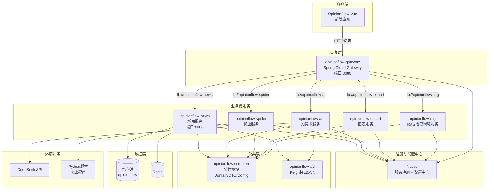
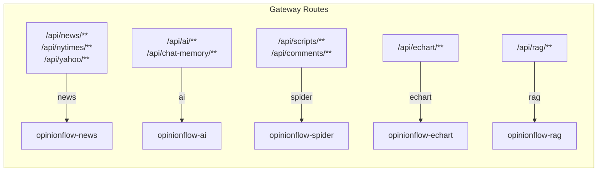
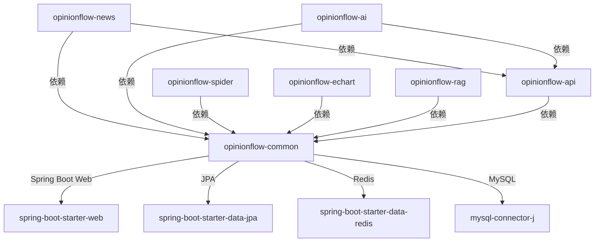

# OpinionFlow-Cloud 微服务项目 — 目录与模块详解

> **项目说明**：OpinionFlow-Cloud 是一个基于 **RuoYi-Cloud-Plus** 架构模式改造的 Kotlin 微服务项目，采用 Spring Boot 3.4.5 + Spring Cloud + Nacos + Kotlin 2.1.20 技术栈。
> 所有目录以 `opinionflow-` 为前缀，对应 RuoYi 中的 `ruoyi-` 前缀模块。

---

## 一、架构总览图（Mermaid）



---

## 二、Gateway 路由架构图



---

## 三、模块依赖关系图



---

## 四、思维导图（Markdown 格式）

```
OpinionFlow-Cloud/
│
├── opinionflow-common/ ──────────── 🔧 公共模块（所有服务的底层依赖）
│   ├── build.gradle.kts             # 依赖: Spring Web, JPA, Redis, MySQL, Jackson
│   └── src/main/kotlin/.../common/
│       └── config/
│           ├── JacksonConfig.kt     # ObjectMapper 配置（JavaTimeModule, 日期格式化）
│           └── WebConfig.kt         # Web MVC 跨域/序列化等全局配置
│       └── domain/                  # (需补充) 实体类: NytNews, NewsArchive, DailyFinance
│       └── dto/                     # (需补充) 数据传输对象
│
├── opinionflow-api/ ─────────────── 📡 Feign 接口定义模块（服务间调用契约）
│   ├── build.gradle.kts             # 依赖: Spring Cloud OpenFeign
│   └── src/main/kotlin/.../api/
│       └── rag/
│           └── RagFeignClient.kt    # RAG 服务的 Feign 客户端接口
│       └── news/                    # (需补充) News 服务 Feign 接口
│       └── ai/                      # (需补充) AI 服务 Feign 接口
│
├── opinionflow-gateway/ ─────────── 🚪 API 网关（Spring Cloud Gateway）
│   ├── build.gradle.kts             # 依赖: spring-cloud-starter-gateway, nacos-discovery
│   ├── Dockerfile                   # 容器化部署配置
│   └── src/main/
│       ├── kotlin/.../gateway/
│       │   └── GatewayApplication.kt  # 网关启动类 (@EnableDiscoveryClient)
│       └── resources/
│           └── application.yml      # 路由配置:
│                                    #   /api/news/**     → lb://opinionflow-news
│                                    #   /api/ai/**       → lb://opinionflow-ai
│                                    #   /api/scripts/**  → lb://opinionflow-spider
│                                    #   /api/echart/**   → lb://opinionflow-echart
│                                    #   + CORS 全局配置
│
├── opinionflow-news/ ────────────── 📰 新闻服务（新闻聚合与金融数据）
│   ├── build.gradle.kts             # 依赖: common, api, JPA, Redis, Nacos, MySQL
│   └── src/main/
│       ├── kotlin/.../news/
│       │   ├── NewsApplication.kt     # 启动类 (@EnableDiscoveryClient, @EnableCaching)
│       │   ├── controller/
│       │   │   ├── NewsController.kt  # 新闻 API: deepseek-menu, general, finance 分页查询
│       │   │   ├── NytimesController.kt  # NYTimes 新闻代理接口
│       │   │   └── YahooController.kt    # Yahoo Finance 代理接口
│       │   ├── entity/                # (需填充) NytNews, NewsArchive, DailyFinance
│       │   ├── repository/            # (需填充) JPA Repository 接口
│       │   └── service/
│       │       └── NewsService.kt     # 新闻业务逻辑: 分页查询, ID查询
│       └── resources/
│           └── application.yml        # 端口 8080, MySQL, Redis, Nacos 配置
│
├── opinionflow-ai/ ──────────────── 🤖 AI 智能服务（DeepSeek 集成）
│   ├── build.gradle.kts             # (需创建) 依赖: common, api, WebFlux/SSE
│   ├── Dockerfile                   # (需创建)
│   └── src/main/
│       ├── kotlin/.../ai/
│       │   ├── AiApplication.kt       # (需创建) 启动类
│       │   ├── controller/
│       │   │   ├── AiController.kt    # AI 解析 API:
│       │   │   │                      #   POST /api/ai/parse — 同步解析
│       │   │   │                      #   POST /api/ai/parse/stream — SSE 流式输出
│       │   │   └── ChatMemoryController.kt  # 聊天记忆管理
│       │   └── service/
│       │       └── AiParseService.kt  # DeepSeek API 调用逻辑（含流式处理）
│       └── resources/
│           └── application.yml        # (需创建)
│
├── opinionflow-spider/ ──────────── 🕷️ 爬虫服务（Python 脚本调度）
│   ├── build.gradle.kts             # (需创建) 依赖: common, Web
│   ├── Dockerfile                   # (需创建)
│   └── src/main/
│       ├── kotlin/.../spider/
│       │   ├── SpiderApplication.kt   # (需创建) 启动类
│       │   ├── controller/
│       │   │   ├── ScriptController.kt   # 脚本执行 API:
│       │   │   │                         #   POST /api/scripts/run — 同步运行
│       │   │   │                         #   POST /api/scripts/run/stream — SSE 流式
│       │   │   │                         #   POST /api/scripts/run-all — 并行运行全部
│       │   │   │                         #   POST /api/scripts/run-all/stream — 全部并行SSE
│       │   │   └── CommentController.kt  # 评论数据查询
│       │   └── service/
│       │       └── ScriptRunnerService.kt  # Python 脚本进程调度（comments/news/realtime）
│       └── resources/
│           └── application.yml
│
├── opinionflow-echart/ ──────────── 📊 图表服务（ECharts JSON 配置管理）
│   ├── build.gradle.kts             # (需创建) 依赖: common, Web, Jackson
│   ├── Dockerfile                   # (需创建)
│   └── src/main/
│       ├── kotlin/.../echart/
│       │   ├── EchartApplication.kt   # (需创建) 启动类
│       │   └── controller/
│       │       └── EchartController.kt  # 图表 API:
│       │                                  #   POST /api/echart/save — 保存JSON配置
│       │                                  #   GET  /api/echart/list — 列出所有图表
│       │                                  #   GET  /api/echart/read/{filename} — 读取图表
│       └── resources/
│           └── application.yml
│
├── opinionflow-rag/ ─────────────── 🔍 RAG 检索增强生成服务
│   ├── build.gradle.kts             # (需创建) 依赖: common, Web
│   ├── Dockerfile                   # (需创建)
│   └── src/main/
│       ├── kotlin/.../rag/
│       │   ├── RagApplication.kt      # (需创建) 启动类
│       │   ├── controller/
│       │   │   └── RagController.kt   # RAG API: 文档检索与问答
│       │   └── service/
│       │       └── RagService.kt      # RAG 核心逻辑
│       └── resources/
│           └── application.yml
│
├── build.gradle.kts                # 根构建脚本: Kotlin 2.1.20, Spring Boot 3.4.5
├── settings.gradle.kts             # 模块声明: 包含所有 8 个子模块
└── README.md
```

---

## 五、各模块详细说明

### 5.1 opinionflow-common — 公共模块

| 文件 | 作用 | 主要方法/配置 |
|------|------|--------------|
| `build.gradle.kts` | 定义公共依赖 | Spring Web, JPA, Redis, MySQL, Jackson |
| `JacksonConfig.kt` | 全局 JSON 序列化配置 | `objectMapper()` — 注册 JavaTimeModule，关闭日期时间戳格式 |
| `WebConfig.kt` | 全局 Web 配置 | CORS 跨域配置、消息转换器等 |

**与 RuoYi 的对应关系**：相当于 `ruoyi-common`，提供所有微服务共享的基础设施。

---

### 5.2 opinionflow-api — Feign 接口模块

| 文件 | 作用 | 主要方法 |
|------|------|---------|
| `build.gradle.kts` | 定义 Feign 依赖 | Spring Cloud OpenFeign |
| `RagFeignClient.kt` | RAG 服务的远程调用接口 | `@FeignClient("opinionflow-rag")` 声明式 HTTP 客户端 |

**与 RuoYi 的对应关系**：相当于 `ruoyi-api`，定义服务间调用的接口契约。

---

### 5.3 opinionflow-gateway — API 网关

| 文件 | 作用 | 主要配置 |
|------|------|---------|
| `build.gradle.kts` | 网关依赖 | spring-cloud-starter-gateway, nacos-discovery |
| `GatewayApplication.kt` | 网关启动类 | `@EnableDiscoveryClient` 服务发现 |
| `application.yml` | 路由 + CORS 配置 | 5 条路由规则：news, ai, spider, echart, rag |
| `Dockerfile` | Docker 部署配置 | 构建网关容器镜像 |

**路由映射**：
| 路径模式 | 目标服务 | 说明 |
|---------|---------|------|
| `/api/news/**`, `/api/nytimes/**`, `/api/yahoo/**` | `opinionflow-news` | 新闻相关 |
| `/api/ai/**`, `/api/chat-memory/**` | `opinionflow-ai` | AI 相关 |
| `/api/scripts/**`, `/api/comments/**` | `opinionflow-spider` | 爬虫相关 |
| `/api/echart/**` | `opinionflow-echart` | 图表相关 |
| `/api/rag/**` | `opinionflow-rag` | RAG 相关 |

**与 RuoYi 的对应关系**：相当于 `ruoyi-gateway`。

---

### 5.4 opinionflow-news — 新闻服务

| 文件 | 作用 | 主要方法 |
|------|------|---------|
| `build.gradle.kts` | 新闻服务依赖 | common, api, JPA, Redis, Nacos, MySQL |
| `NewsApplication.kt` | 启动类 | `@EnableDiscoveryClient`, `@EnableCaching`, `@ComponentScan` |
| `NewsController.kt` | 新闻 REST API | `GET /api/news/deepseek-menu` — DeepSeek菜单分页 |
| | | `GET /api/news/general` — 通用新闻分页 |
| | | `GET /api/news/finance` — 财经新闻分页 |
| | | `GET /api/news/finance/ids` — 财经新闻ID列表 |
| | | `GET /api/news/finance/{id}` — 按ID查财经新闻 |
| | | `GET /api/news/{id}` — 按ID查新闻 |
| `NytimesController.kt` | NYT 新闻代理 | NYTimes API 代理接口 |
| `YahooController.kt` | Yahoo 代理 | Yahoo Finance 数据代理 |
| `NewsService.kt` | 新闻业务逻辑 | `pageDeepseekMenu()`, `pageGeneral()`, `pageFinance()`, `financeIds()`, `getFinanceById()`, `getById()` |
| `application.yml` | 服务配置 | 端口 8080, MySQL/Redis/Nacos 环境变量配置 |

**与 RuoYi 的对应关系**：相当于 `ruoyi-modules/ruoyi-system`，是核心业务服务。

---

### 5.5 opinionflow-ai — AI 智能服务

| 文件 | 作用 | 主要方法 |
|------|------|---------|
| `AiApplication.kt` | 启动类 | `@EnableDiscoveryClient` |
| `AiController.kt` | AI REST API | `POST /api/ai/parse` — 同步 AI 解析 |
| | | `POST /api/ai/parse/stream` — SSE 流式 AI 解析 |
| `ChatMemoryController.kt` | 聊天记忆 | 聊天历史记录管理 CRUD |
| `AiParseService.kt` | AI 核心服务 | `parse(content, systemPrompt)` — 调用 DeepSeek API |
| | | `parseStream(content, systemPrompt, onDelta)` — 流式调用 |

**核心流程**：
```
前端 → POST /api/ai/parse → Gateway → AiController → AiParseService → DeepSeek API → 返回结果
前端 → POST /api/ai/parse/stream → Gateway → AiController → SseEmitter → 流式推送 delta 事件
```

---

### 5.6 opinionflow-spider — 爬虫服务

| 文件 | 作用 | 主要方法 |
|------|------|---------|
| `SpiderApplication.kt` | 启动类 | `@EnableDiscoveryClient` |
| `ScriptController.kt` | 脚本执行 API | `POST /api/scripts/run` — 运行单个脚本 (comments/news/realtime) |
| | | `POST /api/scripts/run/stream` — SSE 流式运行 |
| | | `POST /api/scripts/run-all` — 并行运行全部脚本 |
| | | `POST /api/scripts/run-all/stream` — 并行 + SSE 流式 |
| `CommentController.kt` | 评论查询 | 评论数据查询接口 |
| `ScriptRunnerService.kt` | 脚本调度核心 | `run(key, code)` — 执行 Python 爬虫进程 |
| | | `runStream(key, code, callbacks)` — 流式执行并回调 |

**支持的爬虫 key**：
| key | 说明 | 参数 |
|-----|------|------|
| `comments` | 股票评论爬取 | 需要 `code`（6位股票代码） |
| `news` | 新闻爬取 | 无需额外参数 |
| `realtime` | 实时数据爬取 | 无需额外参数 |

---

### 5.7 opinionflow-echart — 图表服务

| 文件 | 作用 | 主要方法 |
|------|------|---------|
| `EchartApplication.kt` | 启动类 | `@EnableDiscoveryClient` |
| `EchartController.kt` | 图表 REST API | `POST /api/echart/save` — 保存 ECharts JSON 配置文件 |
| | | `GET /api/echart/list` — 列出所有已保存的图表 |
| | | `GET /api/echart/read/{filename}` — 读取指定图表 JSON |
| | | `sanitizeFilename(raw)` — 文件名安全校验（防注入） |

**存储方式**：JSON 文件存储到 `../opinionflow-vue/public/echart/` 目录。

---

### 5.8 opinionflow-rag — RAG 检索增强生成服务

| 文件 | 作用 | 主要方法 |
|------|------|---------|
| `RagApplication.kt` | 启动类 | `@EnableDiscoveryClient` |
| `RagController.kt` | RAG REST API | 文档检索与问答接口 |
| `RagService.kt` | RAG 核心逻辑 | 向量检索 + LLM 生成 |

---

## 六、与 RuoYi-Cloud-Plus 的模块对照表

| OpinionFlow 模块 | RuoYi-Cloud-Plus 对应模块 | 说明 |
|-----------------|-------------------------|------|
| `opinionflow-common` | `ruoyi-common` | 公共工具、配置、Domain |
| `opinionflow-api` | `ruoyi-api` | Feign 接口定义 |
| `opinionflow-gateway` | `ruoyi-gateway` | API 网关 |
| `opinionflow-news` | `ruoyi-modules/ruoyi-system` | 核心业务模块 |
| `opinionflow-ai` | *(无直接对应)* | 项目特有：AI 智能分析 |
| `opinionflow-spider` | *(无直接对应)* | 项目特有：数据爬虫 |
| `opinionflow-echart` | *(无直接对应)* | 项目特有：图表管理 |
| `opinionflow-rag` | *(无直接对应)* | 项目特有：RAG 检索增强 |

---

## 七、技术栈总结

| 层次 | 技术 | 版本 |
|------|------|------|
| 语言 | Kotlin | 2.1.20 |
| 框架 | Spring Boot | 3.4.5 |
| 云原生 | Spring Cloud | 2023.0.3.2 (Alibaba) |
| 注册中心 | Nacos | — |
| 网关 | Spring Cloud Gateway | — |
| 服务调用 | OpenFeign | — |
| ORM | Spring Data JPA | — |
| 数据库 | MySQL | — |
| 缓存 | Redis | — |
| 构建工具 | Gradle (Kotlin DSL) | — |
| JDK | 17 | — |